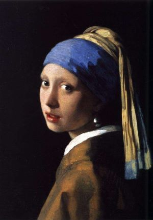
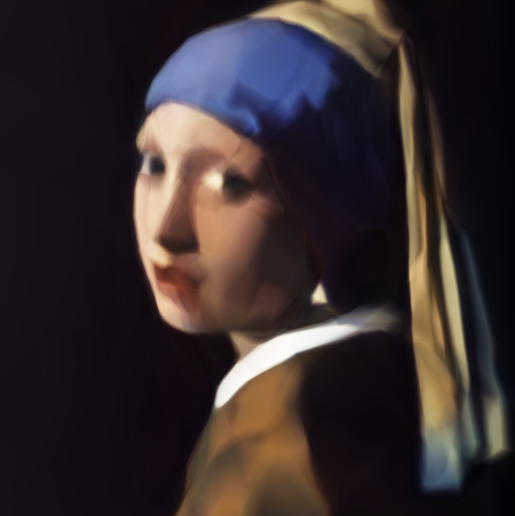

From neural network get parameters for shader inspired by: [https://www.shadertoy.com/view/NstGDM](https://www.shadertoy.com/view/NstGDM)

## Steps

### 1.Get neural network model

Remove `newmodel.h5` first, you can move it to other place.

Set prefer reference image, run `python main.py`. You can change the network parameter for better performance or quality.

When get acceptable reuslt, press 'enter' key (you can just press onece, it will close after finish epoch).

### 2.Show model result image

Run `python show_model.py`, it will show model output image.

### 3.From model to C code

Run `python model_to_c.py`, it will translate the NN model `newmodel.h5` to C code file `gencode.c`.

Copy the code from `gencode.c` to your shader, you can get the image now!

## Result

- reference image

- result image

